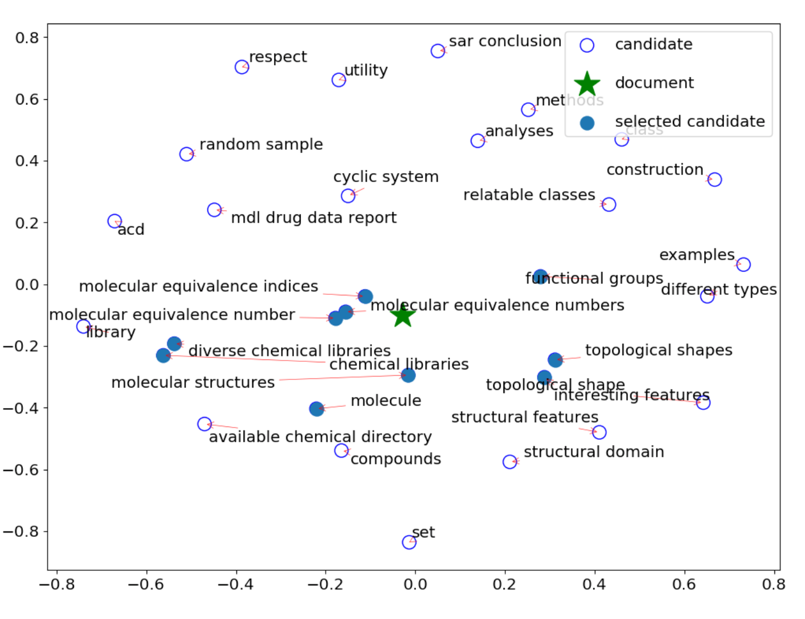
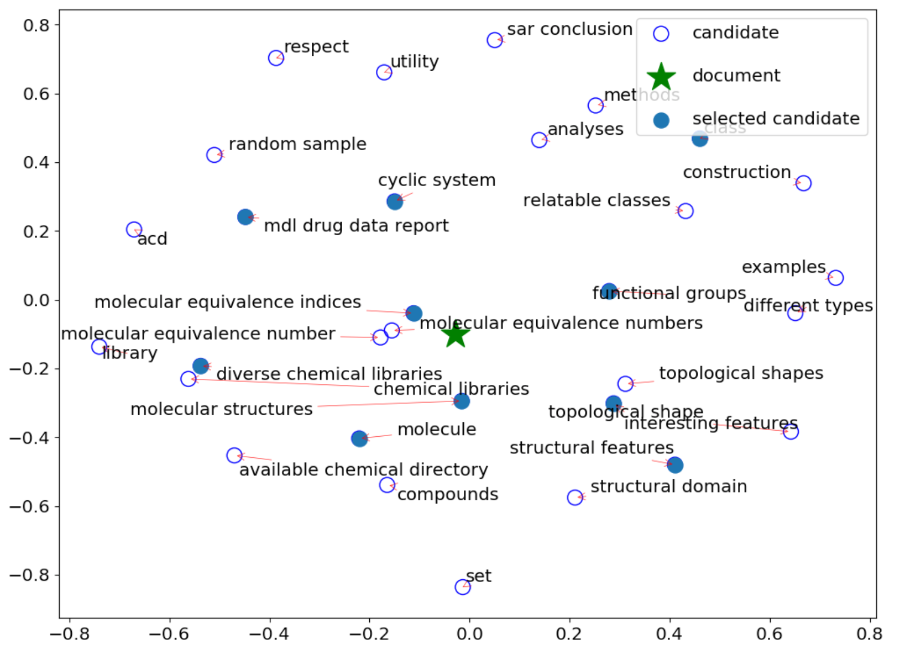
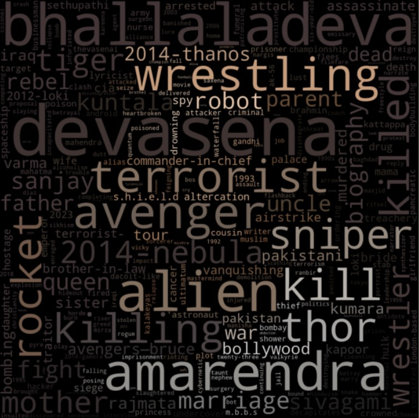

# Basic Information
This is the GitHub Repo for our project 2 of CWL/MACS 207 Spring 2021 at University of Illinois at Urbana Champaign

The formal course description and other informations can also be found [here](https://courses.illinois.edu/schedule/2021/spring/MACS/207)

# Team members: 

Jialiang Xu (jx17)

Jiayuan Hu (jiayuan4)

Yajing Gao (yajingg2)

Yizhen Lu (yizhenl3)

# Usage
```
pip install requirements.txt
jupyter notebook KE\ movie\ plot.ipynb
```

# Introduction 

One of the vital elements of a movie is the plot. More often than not, the plot provides most intuitive presentations of the underlying movie logic and carries most information facilitating viewer understanding. Thus, the task of **plot understanding** is one of the most valuable tasks in movie analysis.  

Currenlty, it is very common that **a major portion of effort and time is paid to extracting the plot features when conducting movie analysis.** Particularly, when the analysis involves multiple movies, manual approaches takes even longer time as per the extra counting and statistics steps involved. 

This project aims to **offer a novel perspective to the task of plot understanding in the context of modern Indian Cinema.** We tackle the problem mainly with Natural Language Processing techniques. We propose an automated pipeline to extract the plot features and generate latent representations for the features. We also included visualization modules to convert the latent features extracted to existent keywords in the plot, and present them in the form of wordclouds. 

The extracted plot features can then be used in downstream tasks such as 

1. Automated movie recommendation
2. Similarity examination
3. Movie classification
4. ... 

As a proof of concept, we selected the top 10 highest grossing movies in the domestic theatre market in India and feed them into the pipeline. **We aim to find similar elements in the plots of these movies.** Via this approach, we expect to gain knowledge about the viewership, specifically, their preferences for plots.    

To refrain the range of the task, we made the following assumptions: 
1. We regard it a reasonable assumption that the response of a large crowd in a society towards a specific movie is predominantly controlled by the plot, i.e. the plot of a movie explains the primary component of its box office collection. 
2. We further assume that the viewer preference is the only factor that determines movie box office collection. 


To summarize, in this project, we

1. Propose an automated pipeline that is capable of extracting latent features in movie plots and quantitatively compare them. 
2. Propose visualizations of the latent plot features with keywords existing in the movie plots.
3. Provide a proof of concept instance of extracting the common features of the top 10 highest grossing movies in the domestic theatre market in India. 


# Method

## Plot accessing 

We access the plot of target movies with the Wikipedia APIs. We use the raw text in the "slot" section on the Wikipedia page of the movie as our plot text. Currently, we use the pageid of the Wikipedia for efficient querying. In our example, the pageid can be found in /resources/movie_ids.json

## Keyword Extraction  

The keywords extraction module mainly utilizes the following key components in sequence: 
1. **A preprocessing unit** that sift out all plausible keyword phrases. 
2. **A pre-trained language models** to encode word/document embeddings. We kept only the high-confidence keyphrases as keyword candidates.
3. **EmbedRank** and **Maximum Marginal Relevance** modules that increases keyword diversity. 
   

### Preprocessing unit
The preprocessing of the plot consists of the following aspects: 
1. A **lemmatizer** that reduces inflectional form of words into its original base via morphological analysis. (e.g. Studying -> study, happiest -> happy). By lemmatization we allow our model to focus more on the meaning of the word instead of the exact expression. 
2. A **combinational tokenizer** that splits the document into possibly meaningful phrases with regular expressions. With a regular tokenizer, we can divide a long string separated by a separator (e.g. the space character ' ') into word tokens. We further sift out all combinations of continuous tokens in the form "zero or more adjectives + one or more nouns" (*JJ\*NN+*) via regular expression. 

### Pre-trained language model (SentenceTransformer) 

In this project, we are using the pre-trained SentenceTransformer model from **HuggingFace**, the specific model we are using is [distilbert-base-nli-mean-tokens](https://huggingface.co/sentence-transformers/bert-base-nli-mean-tokens). 

This pre-trained model allows us to map a word or a document to a vector in a high-dimensional (768 dimensions) semantic space. 

i.e. For any word $W$, the embedding of $W$ is given by 
$$W_{embedding} = SentenceTransformer.encode(W)$$

The embedding vector can be used as mathematical calculation ingredients. For example, 
$$King_{embedding} - Man_{embedding} + Woman_{embedding} = Queen_{embedding} $$

In this project, we use the embedding vectors to calculate the similarity between a word and the document containing it. Specifically, we will use the cosine similarity between the document embedding vector and the word embedding vector as the quantitative measure for the similarity between a word and the document containing it. This similarity will be used as the criterion for keywords identification. 

### EmbedRank with Maximum Marginal Relevance (MMR)

The keyword extraction result with the approach above suffer from two major issues:

1. **Word Homogeneity**, some of the selected keywords may only be morphological variations of each other. 
2. **Incomplete coverage**, due to the concentration of the keyword selection centering the document embedding vector. 

For a concrete example, we use the following scenario as presented in the [original paper](https://www.aclweb.org/anthology/K18-1022/), 


Here we see both a overly homogeneous selection (e.g. *molecular equivalence numbers*, *molecular equivalence indices*, and *molecular equivalence number*) and an incomplete coverage of keywords. 

EmbedRank with MMR is proposed to tackle this issue. MMR is a mathematical approach that diversify the selection. The strength of this diversifying effect is controlled by a user-specified hyperparameter (*Diversity factor*). We will not go into the unnecessary mathematic details here due to many reasons. 

The result of improvement, with MMR, is as follows:

 

As can be observed, the previous issues has been alleviated. 

## Visual representaion

We represent our final output with wordclouds, where the size of a word in the image represents the importance (higher similarity between the word embedding vector and the document embedding vector) of that word in its original document. 

## Result

The keyword wordcloud for the top 10 movies: 

 

